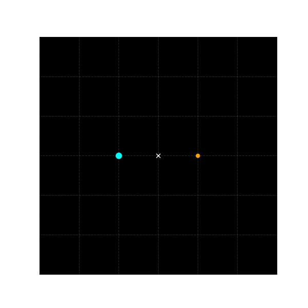

# 🌌 Binary Star System Simulator

A computational physics simulation of a binary star system using numerical methods and classical mechanics.

---

## 🎬 Simulation Preview



---

## 🚀 Features

* Simulation of two-body gravitational interaction
* Runge-Kutta (RK4) numerical integration
* Real-time animation using matplotlib
* Barycenter (center of mass) visualization
* Unequal mass system behavior
* Exportable GIF simulation

---

## 🧠 Physics Behind the Simulation

This project is based on fundamental concepts of classical mechanics:

* Newton's Law of Gravitation
* Two-body problem in celestial mechanics
* Center of mass (barycenter)

The motion of the stars is governed by gravitational forces and solved using the Runge-Kutta (RK4) method, which provides high accuracy for numerical integration.

In unequal mass systems, the heavier star moves in a smaller orbit while the lighter star follows a larger orbit around the barycenter.

---

## 🚀 Project Highlights

* Developed a physics-based simulation from scratch
* Implemented RK4 numerical integration
* Visualized orbital motion with animation
* Modeled realistic astrophysical behavior

---

## ⚙️ Technologies Used

* Python
* NumPy
* Matplotlib

---

## ⚙️ How to Run

```bash
pip install numpy matplotlib pillow
python main.py
```

---

## 📊 Output

* Animated binary star motion
* Orbit trails
* Barycenter visualization
* GIF file (`binary_star.gif`)

---

## 📌 Project Goal

To understand how binary star systems behave using computational methods and visualize their motion in a physically accurate way.

---

## 🔮 Future Improvements

* Extend to N-body simulation
* Add energy conservation plots
* Improve visualization with interactive UI
* Simulate galaxy formation

---

## 💡 Simple Explanation

This project simulates how two stars move around each other in space using physics and code, showing their orbits and interaction visually.

---

## 🚀 One-Line Pitch

Developed a binary star system simulator using RK4 numerical integration to model gravitational interactions and visualize orbital dynamics.

---

## 👨‍💻 Author

Abhishek — Aspiring Astrophysicist 🚀
